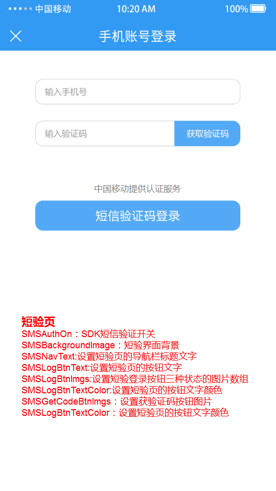

# 1. 接入指南

sdk技术问题沟通QQ群：609994083</br>
sdk支持版本：iOS8.0及以上</br>
本文档为一键登录SDK5.3.9版本的开发文档</br>


**注意事项：**

1. **认证取号服务必须打开蜂窝数据流量并且手机操作系统给予应用蜂窝数据权限才能使用**
2. **取号请求过程需要消耗用户少量数据流量（国外漫游时可能会产生额外的费用）**
3. **认证取号服务目前支持中国移动2/3/4G和中国电信4G**

## 1.1. 接入流程

**1.申请appid和appkey**

根据《开发者接入流程文档》，前往中国移动开发者社区（dev.10086.cn)，按照文档要求创建开发者账号并申请appid和appkey，并填写应用的包名（bundle ID)。

**2.申请能力**

应用创建完成后，在能力配置页面上，勾选应用需要接入的能力类型，如一键登录，并配置应用的服务器出口IP地址。（如果在服务端需要用非对称加密方法对一些重要信息进行加密处理，请在能力配置页面填写RSA加密的公钥）

## 1.2. 开发流程

**第一步：下载SDK及相关文档**

请在开发者群或官网下载最新的SDK包

**第二步：搭建开发环境**

1. xcode版本需使用9.0以上，否则会报错
2. 导入认证SDK的framework，直接将移动认证`TYRZSDK.framework`拖到项目中
3. 在Xcode中找到`TARGETS-->Build Setting-->Linking-->Other Linker Flags`在这选项中需要添加`-ObjC`

**第三步：开始使用移动认证SDK**

**[1] 初始化SDK**

在appDelegate.m文件的`didFinish`函数中添加初始化代码。初始化代码只需要执行一次就可以。

```objective-c
- (BOOL)application:(UIApplication *)application didFinishLaunchingWithOptions:(NSDictionary *)launchOptions {
    
    [UASDKLogin.shareLogin registerAppId:@"xxxxxxxx" AppKey:@"xxxxxxxx"];

        
    return YES;
}
```

**方法原型：**

```objective-c
- (void)registerAppId:(NSString *)appId AppKey:(NSString *)appKey;
```

**参数说明：**

| 参数   | 类型     | 说明        |
| ------ | -------- | ----------- |
| appId  | NSString | 应用的appid |
| appKey | NSString | 应用密钥    |

<div STYLE="page-break-after: always;"></div>

# 2. 一键登录功能

## 2.1. 准备工作

在中国移动开发者社区进行以下操作：

1. 获得appid和appkey、APPSecret（服务端）；
2. 勾选一键登录能力；
3. 配置应用服务器的出口ip地址
4. 配置公钥（如果使用RSA加密方式）

## 2.2. 流程说明


## 2.3. 取号请求

本方法用于发起取号请求，SDK完成网络判断、蜂窝数据网络切换等操作并缓存凭证scrip。

**取号方法原型**

```objective-c
- (void)getPhoneNumberCompletion:(void(^)(NSDictionary *_Nonnull result))completion;
```

**参数说明：**

| 参数     | 类型  | 说明     |
| -------- | ----- | -------- |
| complete | Block | 取号回调 |

**响应参数：**

| 参数       | 类型     | 说明             |
| ---------- | -------- | ---------------- |
| resultCode | NSString | 返回相应的结果码 |
| desc       | NSString | 调用描述         |

**请求示例代码**

```objective-c
[UASDKLogin.shareLogin getPhoneNumberCompletion:^(NSDictionary * _Nonnull sender) {
     
        NSString *resultCode = sender[@"resultCode"];
        NSMutableDictionary *result = [NSMutableDictionary dictionaryWithDictionary:sender];
        if ([resultCode isEqualToString:CLIENTSUCCESSCODECLIENT]) {
            NSLog(@"预取号成功");
        } else {
            NSLog(@"预取号失败");
        }
        [self showInfo:result];
    }];
```

## 2.4. 使用短信验证码（可选）

SDK提供短信验证码作为网关取号的补充功能，短验功能只有在网关取号失败时才能使用。

**注意：**

1. 目前短信验证码只支持移动和电信手机号码
2. 无网络时，不提供短验服务

**使用方法：**

通过设置Model属性中SMSAuthOn值确定是否使用短信验证码服务(参考2.6.2)

NO（默认）：不使用SDK提供的短验服务，此时如果用户点击“切换账号”，SDK将返回200060返回码

YES：使用SDK提供的短验服务


## 2.5. 授权请求

应用调用本方法时，SDK将拉起用户授权页面，用户确认授权后，SDK将返回token给应用客户端。

**授权请求方法原型**

```objective-c
- (void)getAuthorizationWithModel:(UACustomModel *)model 
                         complete:(void (^)(id sender))completion;
```

**请求参数：**

| 参数     | 类型          | 说明                              |
| -------- | ------------- | --------------------------------- |
| model    | UACustomModel | 需要配置的Model属性（控制器必传） |
| complete | Block         | 取号回调                          |

**响应参数：**

| 参数       | 类型     | 说明                                                         |
| ---------- | -------- | ------------------------------------------------------------ |
| resultCode | NSString | 返回相应的结果码                                             |
| token      | NSString | 成功时返回：临时凭证，token有效期2min，一次有效，同一用户（手机号）10分钟内获取token且未使用的数量不超过30个 |


**请求示例代码**

```objective-c
//    NSDecimalNumber *begin = [self.class startLoading];
    UACustomModel *model = [[UACustomModel alloc]init];
    model.currentVC = self;//必传
    model.authPageBackgroundImage = [UIImage imageNamed:@"tooopen_sy_122409821526"];
//    model.numberSize = 10;
//    model.navReturnImg = [UIImage imageNamed:@"tooopen_sy_122409821526"];
//    model.logBtnImgs = @[[UIImage imageNamed:@"12341553737084_.pic_hd"],[UIImage imageNamed:@"12341553737084_.pic_hd"],[UIImage imageNamed:@"12341553737084_.pic_hd"]];
//    model.logBtnImgs = []
//    model.navCustom = YES;
//    model.authViewBlock = ^(UIView *customView) {
//        UIImageView *ima = [[UIImageView alloc]initWithImage:[UIImage imageNamed:@"tooopen_sy_122409821526"]];
//        ima.frame = customView.bounds;
//        [customView addSubview:ima];
//    };
//    model.customSMSFlag = YES;
    [UASDKLogin.shareLogin getAuthorizationWithModel:model complete:^(NSDictionary * _Nonnull sender) {
//        NSDecimalNumber *end = [self.class stopLoading];
//        NSDecimalNumberHandler *subHandler = [self.class roundPlainWithScale:3];
//        NSDecimalNumber *delta = [end decimalNumberBySubtracting:begin withBehavior:subHandler];
//        NSMutableDictionary *result = [sender mutableCopy];
//        result[@"duration"] = delta;
//        [self displayObject:result withTitle:@"一键登录" alertActionHandler:^(UIAlertAction * _Nonnull action) {

//        [self dismissViewControllerAnimated:YES completion:nil];
        [self displayObject:sender];

//        }];
    }];

```


## 2.6. 授权页面设计

为了确保用户在登录过程中将手机号码信息授权给开发者使用的知情权，一键登录需要开发者提供授权页登录页面供用户授权确认。开发者在调用授权登录方法前，必须弹出授权页，明确告知用户当前操作会将用户的本机号码信息传递给应用。

### 2.6.1. 页面规范细则





**注意：开发者不得通过任何技术手段，将授权页面的隐私栏、品牌露出内容隐藏、覆盖，对于接入移动认证SDK并上线的应用，我方会对上线的应用授权页面做审查，如果有出现未按要求设计授权页面，将隐私栏、品牌等UI隐去不可见的设计，我方有权将应用的登录功能下线。**

### 2.6.2. Model属性

通过model属性，可以实现：

1、可以允许开发者在授权页面上添加自定义的控件；

2、授权页面推出的动画效果

3、设置授权页面和短信验证码页面的元素控件的布局

**当前VC，注意：使用一键登录服务时，这个值必传**

```objective-c
@property (nonatomic,strong) UIViewController *currentVC;
```


**授权界面自定义控件View的Block**

| model属性  | 值类型        | 属性说明                 |
| ---------- | ------------- | ------------------------ |
| customView | authViewBlock | 设置授权页应用自定义控件 |

示例：

```objective-c
model.authViewBlock = ^(UIView *customView) {
UIImageView *ima = [[UIImageView alloc]initWithImage:[UIImage imageNamed:@"tooopen_sy_122409821526"]];
        ima.frame = customView.bounds;
        [customView addSubview:ima];
    };
```


**授权页面推出动画效果**

| model属性   | 值类型                  | 属性说明         |
| ----------- | ----------------------- | ---------------- |
| presentType | UAPresentationDirection | 设置推出动画效果 |

**导航栏状态栏设置**

| model属性    | 值类型             | 属性说明                                                     |
| ------------ | ------------------ | ------------------------------------------------------------ |
| navColor     | UIColor            | 设置导航栏颜色（授权页短验页一致）                           |
| navText      | NSAttributedString | 设置导航栏标题文字                                           |
| barStyle     | UIBarStyle         | 状态栏着色样式（授权页短验页一致）                           |
| navReturnImg | UIImage            | 设置导航栏返回按钮图标（授权页短验页一致）                   |
| navControl   | UIBarButtonItem    | 导航栏右侧自定义控件，如果导航栏隐藏了，该项不生效（授权页短验页一致） |
| navCustom    | BOOL               | 隐藏导航栏（授权页短验页一致）                               |

**授权页背景**

| 方法                    | 值类型  | 说明               |
| ----------------------- | ------- | ------------------ |
| authPageBackgroundImage | UIImage | 设置授权页背景图片 |

**授权页logo**

| model属性   | 值类型  | 属性说明                        |
| ----------- | ------- | ------------------------------- |
| logoImg     | UIImage | 设置logo图片                    |
| logoWidth   | CGFloat | 设置logo宽度                    |
| logoHeight  | CGFloat | 设置logo高度                    |
| logoOffsetY | CGFloat | 设置logo相对于标题栏下边缘y偏移 |
| logoHidden  | BOOL    | 隐藏logo                        |

**号码栏**

| model属性       | 值类型  | 属性说明                       |
| --------------- | ------- | ------------------------------ |
| numberColor     | UIColor | 手机号码字体颜色               |
| numberSize      | CGFloat | 手机号码字体大小               |
| numFieldOffsetY | CGFloat | 号码栏Y相对于标题栏下边缘y偏移 |

**登录按钮**

| model属性       | 值类型   | 属性说明                                                     |
| --------------- | -------- | ------------------------------------------------------------ |
| logBtnText      | NSString | 设置登录按钮文字                                             |
| logBtnTextColor | UIColor  | 设置登录按钮文字颜色                                         |
| logBtnImgs      | NSArray  | 设置授权登录按钮三种状态的图片数组，数组顺序为：[0]激活状态的图片；[1] 失效状态的图片；[2] 高亮状态的图片 |
| logBtnOffsetY   | CGFloat  | 设置登录按钮相对于标题栏下边缘y偏移                          |

**切换账号**

| model属性         | 值类型  | 属性说明                              |
| ----------------- | ------- | ------------------------------------- |
| switchOffsetY     | CGFloat | 设置切换账号相对于标题栏下边缘y偏移   |
| swithAccHidden    | BOOL    | 隐藏切换账号按钮，YES时隐藏“切换账号” |
| swithAccTextColor | UIColor | “切换账号”字体颜色                    |

**隐私条款**

| model属性       | 值类型  | 属性说明                                                     |
| --------------- | ------- | ------------------------------------------------------------ |
| appPrivacyOne   | NSArray | 设置开发者隐私条款1名称和URL(名称,url)                       |
| appPrivacyTwo   | NSArray | 设置开发者隐私条款2名称和URL(名称,url)                       |
| appPrivacyColor | NSArray | 设置隐私条款名称颜色和协议文字颜色(基础文字颜色，协议文字颜色) |
| uncheckedImg    | UIImage | 设置复选框未选中时图片                                       |
| checkedImg      | UIImage | 设置复选框选中时图片                                         |
| privacyState    | BOOL    | 隐私条款check框默认状态<br/>默认:NO                          |
| privacyOffsetY  | CGFloat | 设置隐私条款相对于授权页面底部下边缘y偏移                    |

**授权页slogan**

| model属性       | 值类型  | 属性说明                          |
| --------------- | ------- | --------------------------------- |
| sloganTextColor | UIColor | 设置移动slogan文字颜色            |
| sloganOffsetY   | CGFloat | 设置slogan相对于标题栏下边缘y偏移 |

**短信验证码页面**

| model属性          | 值类型             | 属性说明                                                     |
| ------------------ | ------------------ | ------------------------------------------------------------ |
| SMSAuthOn          | BOOL               | SDK短信验证码开关（默认为NO）</br>NO:不使用SDK提供的短验；</br>YES：使用SDK提供的短验 |
| SMSBackgroundImage | UIImage            | 短验界面背景                                                 |
| SMSNavText         | NSAttributedString | 设置短验页的导航栏标题文字                                   |
| SMSLogBtnText      | NSString           | 设置短验页的按钮文字                                         |
| SMSLogBtnImgs      | NSArray            | 设置短验登录按钮三种状态的图片数组，数组顺序为：[0]激活状态的图片；[1] 失效状态的图片；[2] 高亮状态的图片 |
| SMSGetCodeBtnImgs  | NSArray            | 设置获取验证码按钮三种状态的图片数组，数组顺序为：[0]激活状态的图片；[1] 失效状态的图片 |
| SMSLogBtnTextColor | UIColor            | 设置短验页的按钮文字颜色                                     |

### 2.6.3. 授权页面的关闭

开发者可以自定义关闭授权页面。

**代码示例**

```objective-c
…………
[self dismissViewControllerAnimated:YES completion:nil];
…………
```

## 2.7. 获取手机号码（服务端）

详细请开发者查看移动认证服务端接口文档说明。


# 3. 本机号码校验

## 3.1. 准备工作

在中国移动开发者社区进行以下操作：

1. 获得appid和appkey、APPSecret（服务端）；
2. 勾选本机号码校验能力；
3. 配置应用服务器的出口ip地址
4. 配置公钥（如果使用RSA加密方式）
5. 勾选本机号码校验短验辅助开关（可选）
6. 商务对接签约（未签约应用每个appid每天只能调用1000次）

## 3.2. 使用流程说明


## 3.3. 取号请求

详情可参考一键登录的取号请求说明（2.3章）


## 3.4. 本机号码校验请求token

开发者可以在应用内部任意页面调用本方法，获取本机号码校验的接口调用凭证（token）

**本机号码校验方法原型**

```java
/**
 本机号码校验
 @param complete 回调
 */
- (void)mobileAuthCompletion:(void(^)(NSDictionary *_Nonnull result))completion;

```

**请求参数说明：**

| 参数     | 类型   | 说明     |
| :------- | :----- | :------- |
| complete | String | 方法回调 |

**响应参数：**

| 字段       | 类型   | 含义                                                         |
| ---------- | ------ | ------------------------------------------------------------ |
| resultCode | Int    | 接口返回码，“103000”为成功。                                 |
| token      | String | 成功返回:临时凭证，token有效期2min，一次有效，同一用户（手机号）10分钟内获取token且未使用的数量不超过30个 |


## 3.5. 本机号码校验（服务端）

详细请开发者查看移动认证服务端接口文档说明。


# 4. 其它SDK请求方法

## 4.1. 获取网络状态和运营商类型

本方法用于获取用户当前的网络环境和运营商

网络类型及运营商（双卡下，获取上网卡的运营商）

**原型**

```objective-c
@property (nonatomic,readonly) NSDictionary<NSString *, NSNumber *> *networkInfo;
```

**响应说明**

| 参数        | 类型         | 说明                                                   |
| ----------- | ------------ | ------------------------------------------------------ |
| networkInfo | NSDictionary | <运营商, 网络类型> |

字典对应的键值：

carrier（运营商）：0.未知 / 1.中国移动 / 2.中国联通 / 3.中国电信

networkType（网络类型）：0.无网络/ 1.数据流量 / 2.wifi / 3.数据+wifi

## 4.2. 删除临时取号凭证

本方法用于删除取号方法`getPhoneNumberWithTimeout`成功后返回的取号凭证scrip

**原型**

```objective-c
- (BOOL)delectScrip;
```

**响应说明**

| 参数  | 类型 | 说明                                          |
| ----- | ---- | --------------------------------------------- |
| state | BOOL | 删除结果状态，（YES：删除成功，NO：删除失败） |

<div STYLE="page-break-after: always;"></div>

## 4.3. 自定义请求超时设置

本方法用于删除取号方法`getPhoneNumberWithTimeout`成功后返回的取号凭证scrip

**原型**

```objective-c
- (void)setTimeoutInterval:(NSTimeInterval)timeout;
```

**响应说明**

| 参数    | 类型           | 说明                                                         |
| ------- | -------------- | ------------------------------------------------------------ |
| timeout | NSTimeInterval | 设置取号、授权请求和本机号码校验请求时的超时时间，开发者不配置时，默认所有请求的超时时间都为8000，单位毫秒 |

<div STYLE="page-break-after: always;"></div>

# 5. 返回码说明

## 5.1. SDK返回码

| 返回码 | 返回码描述                                                   |
| ------ | ------------------------------------------------------------ |
| 103000 | 成功                                                         |
| 103108 | 短信验证码错误                                               |
| 103125 | 手机号码格式错误                                             |
| 200014 | 手机号码不存在                                               |
| 200020 | 用户取消登录                                                 |
| 200021 | 数据解析异常                                                 |
| 200022 | 无网络                                                       |
| 200023 | 请求超时                                                     |
| 200025 | 其他错误（socket、系统未授权数据蜂窝权限等，如需要协助，请加入qq群发问） |
| 200027 | 未开启数据网络                                               |
| 200028 | 网络请求出错                                                 |
| 200030 | 没有初始化参数                                               |
| 200038 | 异网重定向失败                                               |
| 200039 | 电信取号接口返回失败                                         |
| 200048 | 未安装sim卡                                                  |
| 200050 | EOF异常                                                      |
| 200060 | 切换账号（未使用SDK短验时返回）                              |
| 200061 | 授权页面异常                                                 |
| 200062 | 预取号不支持联通                                             |
| 200063 | 预取号不支持电信                                             |
| 200064 | 服务端返回数据异常                                           |
| 200072 | CA根证书校验失败                                             |
| 200080 | 本机号码校验仅支持移动手机号                                 |
| 200082 | 服务器繁忙                                                   |

# 6.常见问题

产品简介

1. 一键登录与本机号码校验的区别？
   - 一键登录有授权页面，开发者经用户授权后可获得号码，适用于注册/登录场景；本机号码校验不返回号码，仅返回待校验号码是否本机的校验结果，适用于所有基于手机号码进行风控的场景。
2. 一键登录支持哪些运营商？
   - 一键登录目前仅支持移动、电信手机号码
3. 移动认证是否支持小程序和H5？
   - 暂不支持
4. 移动认证对于携号转网的号码，是否还能使用？
   - 移动认证SD不提供判断用户是否为携号转网的Api，但提供判断用户当前流量卡运营商的方法。即携号转网的用户仍然能够使用移动认证
5. 移动认证的原理？
   - 通过运营商数据网关获取当前流量卡的号码
6. 一键登录是否支持多语言？
   - 暂不支持
7. 一键登录是否具备用户取号频次限制？
   - 对获取token的频次有限制，同一用户（手机号）10分钟内获取token且未使用的数量不超过30个

能力申请

1. 注册邮件无法激活
   - 由于各公司企业邮箱的限制，请尽量不使用企业邮箱注册，更换其他邮箱尝试；如无法解决问题，需发邮件至平台客服邮件激活：kfptfw@aspirecn.com
2. 服务器IP白名单填写有没有要求？
   - 业务侧服务器接口到移动认证接口访问时，会校验请求服务器的IP地址，防止业务侧用户信息被盗用风险。IP白名单目前同时支持IPv4和IPv6，支持最大4000字符，并支持配置IP段。
3. 安卓和苹果能否使用一个AppID？
   - 需分开创建appid
4. 包签名修改问题？
   - 包名和包签名提交后不支持修改，建议直接新建应用
5. 包签名不一致会有哪些影响？
   - SDK会无法使用

SDK使用问题：

1. 最新的移动服务条款在哪里查询？
   - 最新的授权条款请见：https://wap.cmpassport.com/resources/html/contract.html 
2. 游戏类授权页面能否使用横屏显示？
   - 从Android5.6.5版本和iOS5.3.9版本开始，一键登录授权页支持横屏显示。
3. 授权页面可以关闭跳转到短信验证页面吗?是否可以选择使用应用原有的短验而不使用SDK自带的？
   - 可以，详见接入文档【使用短信验证码】章节。应用如果没有短验，可以自行去掉。
4. 一键登录sdk的短信验证页能不能单独调用？
   - 不能，短信验证码仅作为网关取号失败后的补充
5. 用户点击授权后，授权页会自动关闭吗？
   - 不能，需要开发者调用一下dissmiss，详情见【finish授权页】章节
6. 同一个token可以多次获取手机号码吗？
   - token是单次有效的，一个token最多只能获取一次手机号。
7. 如何判断调用方法是否成功？
   - 方法调用后SDK会给出返回码，103000为成功，其余为调用失败。建议应用捕捉这些返回码，可用于日常数据分析。


如果未能解决您的问题，请加入sdk技术问题沟通QQ群：609994083。

